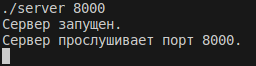
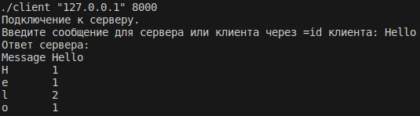
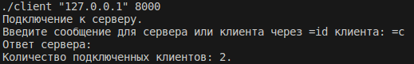
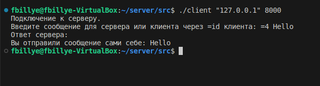

# Проект "Сервер-клиент"

https://github.com/InAnotherLife/server

https://t.me/JohnWooooo

## О проекте
Приложение разработано на языке С++ стандарта C++17. Код программы находится в папке src. Приложение имеет консольный интерфейс.

## Стек
* С++17
* GCC 11.4.0
* Ubuntu 22.04

## Описание
Проект представляет собой два приложения: сервер и клиент. Эти приложения взаимодейстуют между собой через протокол TCP/IP.\
Сервер может подключать несколько клиентов одновременно и производить обработку сообщений, поступающих от них. Сервер производит подсчет количества разных букв в сообщении.\
Клиент производит подключение к серверу и может отправлять сообщения на сервер.

## Сборка
Сборка программы осуществляется с помощью Makefile. Цели:
* all - компиляция программы
* clean - удалить временные файлы, созданные в процессе компиляции 
* clang-format - автоматическое форматирование исходного кода (стиль Google)
* linter - проверка исходного кода на соответствие стандартам и правилам
* cppcheck - запуск статического анализатора кода для поиска ошибок и потенциальных проблем

Необходимо перейти в папку src и выполнить команду:
```
make <цель>
```

## Запуск
Необходимо запустить сервер, указав порт сервера:
```
./server 8000
```



Для запуска клиента необходимо ввести ip-адрес и порт сервера. Затем нужно ввести сообщение для сервера. Сервер посчитает количество разных букв в сообщении и вернет таблицу.
```
./client "127.0.0.1" 8000
```



Для вывода количества поключенных клиентов необходимо отправть серверу команду =с или =clients:



Чтобы отправить сообщение клиентов, необходимо ввести сообщение через =id клиента:


