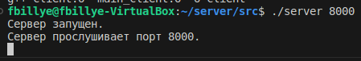
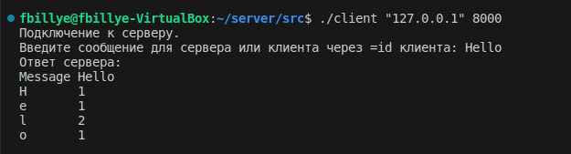

# Проект "Сервер-клиент"

https://github.com/InAnotherLife/server

https://t.me/JohnWooooo


## О проекте
Проект представляет собой два приложения: клиент, сервер. Данные приложения взаимодейстуют между собой через протокол TCP/IP.\
Сервер позволяет подключать несколько клиентов одновременно и производит обработку сообщений, поступающих от них.\
Клиент производит подключение к серверу и может отправлять сообщения на сервер.\
Приложение разработано на языке С++ стандарта C++17. Код программы находится в папке src. Приложение имеет консольный интерфейс.\

## Сборка

Сборка программы осуществляется с помощью Makefile. Цели:
* all - компиляция программы
* clean - удалить временные файлы, созданные в процессе компиляции 
* clang-format - автоматическое форматирование исходного кода (стиль Google)
* linter - проверка исходного кода на соответствие стандартам и правилам
* cppcheck - запуск статического анализатора кода для поиска ошибок и потенциальных проблем

Необходимо перейти в папку src и выполнить команду:
```
make <цель>
```

## Запуск
После компиляции программы необходимо запустить сервер и указать порт сервера:
```
./server
```



Для запуска клиента необходимо ввести ip-адрес и порт сервера:
```
./client "127.0.0.1" 8000
```


